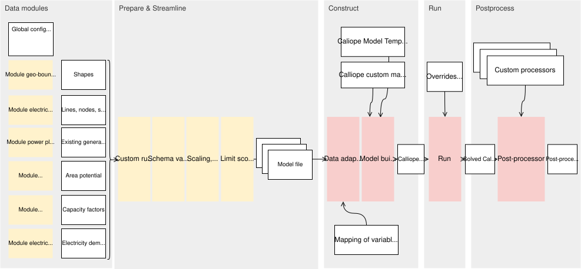

# A module integration workflow that builds energy sytem models

In brief, this workflow integrates several data modules to generate a set of Calliope models, run them, and postprocess the results.

## Overview

The workflow produces energy models for Europe at arbitrary spatial resolution and for many weather years.

The workflow is organised in five general phases: data modules, integration & streamlining, model construction, model run, and postprocessing. The first two phases generate and integrate the module data into a consistent set of model files. These first two stages are framework-agnostic. That means, the produced files are in consistent data format that can be used to build energy models with any energy modeling framework. At the third stage, the model files are adapted to meet the requirements of a specific modeling framework (here: Calliope). The model can then be run, and subsequently postprocessed, in preparation for the analysis. In summary, there are 4 types of output: Model files, Calliope models, run Calliope models, and postprocessed results.

The workflow allows several levels of configuration:
- The spatial resolution can be defined by configuring the module_geo_boundaries.
- The temporal scope can be configured via the global config file.
- Other global config items can be adapted in the global config file, which is passed to all modules.
- Specific module settings and assumptions can be configured by adapting the respective module config file.

Beyond that, the workflow can be customised by
- adding custom scripts, for example to create scenarios by combining or adapting data;
- adding data modules, for example for covering other technologies or refining some assumptions;
- adding model templates to construct models with a different formulation;
- adding postprocessing routines.

## Configuring and customising the workflow

### Unit scaling and zero threshold
Any of the datasets in "prepare" may need to be scaled
Can be defined in config

### Limit spatial scope and technology scope
Now, there is a rule in wind-value map that limits scope. In it, there are explicit functions for each type of table.

To be applied when constructing. Can be achieved by filtering the data in prepare
- Module geo boundaries defines the regions.
- Nodes are defined in the grid

Technology scope depends on the template and on filtering the data in prepare

### Add data modules

### Custom data processing scripts
Define custom scripts and rules that alter the prepared data

### Custom model templates
You can add your own template components
custom/template_components/

### Custom postprocessing routines.
Add custom postprocessing routines in 
custom/postprocessing.py

### Construct a model for another optimisation framework
For now, just end at the "prepare" stage. Other model constructors may be added in the future.

## Structure

Directory structure

The module outputs are stored within module-specific folders.
The workflow imports several data modules.
Module outputs are adapted to meet the common data schemas.
The corresponding rules are within the module-specific .smk. The outputs in the module results directory "results_adapted"
Module outputs can also be adapted with custom rules

Custom rules derive other quantities, combine data, etc. to prepare a dataset 
Im
All input data is validated against a generic schema
After that, the data can be filtered, scaled, zero-thresholds applied
Shapes are mapped to model nodes, technologies to techs
Data adapters can re-arrange the format to fit a specific framework

There are several target rules that you can run to create results. `construct_all_eu` will construct all
available Europe-level models at resolution NUTS0 and NUTS2. `run_min_cost_eu` runs all the cost-minimising
models, while `run_max_techs_eu` runs the models that maximise the deployment of a given technology.

Before constructing models, you can also run the target rule for a specific module. Each rule `rules/0_module_*.smk`
contains a target rule that triggers the output of the module.

Rules in `rules/2_prepare.smk` further process the data to meet the data model of the Calliope models. Intermediate
results are stored in `results/prepare/`.

Based on the data in `results/prepare/`, the rules in `rules/3_construct.smk` construct the Calliope models. Different models
can be constructed based on specific templates, defined in `template_components`.

After running the models, the results can be post-processed one-by-one or for several models at once, using
the `Postprocessor` and `Processor` classes, together with extendable routines that process `calliope.Model` results and
return a `pandas.DataFrame`.
